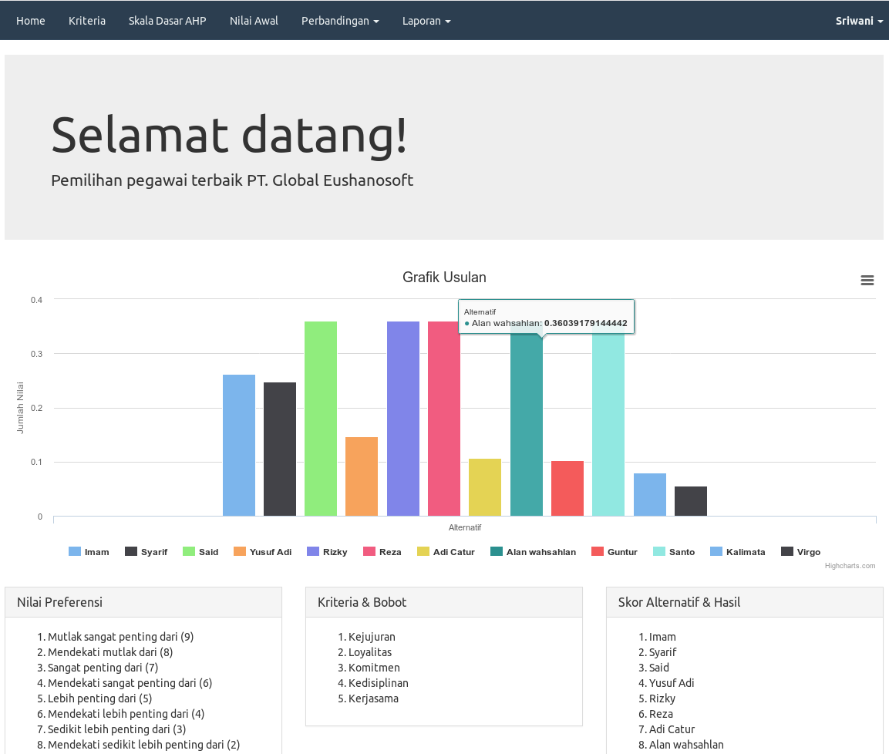
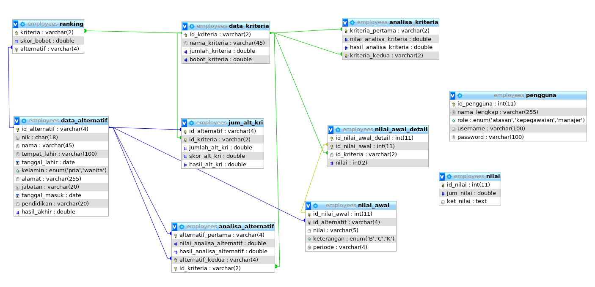

# Pemilihan Siswa Berprestasi

Implementasi metode AHP pada pemilihan Siswa berprestasi.



## Cara menggunakan
1. Clone repository
    ```
    $ git clone https://github.com/said096/ahp-siswa-berprestasi
    ```
2. Letakkan folder didalam root direktori web server
3. Import `database.sql`
4. Ubah properti konfigurasi database pada file `includes/config.php` sesuai dengan koneksi database anda
5. Kunjungi [localhost/simple-selection-employees-dss-ahp](http://localhost/simple-selection-employees-dss-ahp)



## Cara melakukan perubahan
```
$ git add -A
$ git commit -m "pesan perubahan"
$ git push origin maser
$ git pull origin master
```
